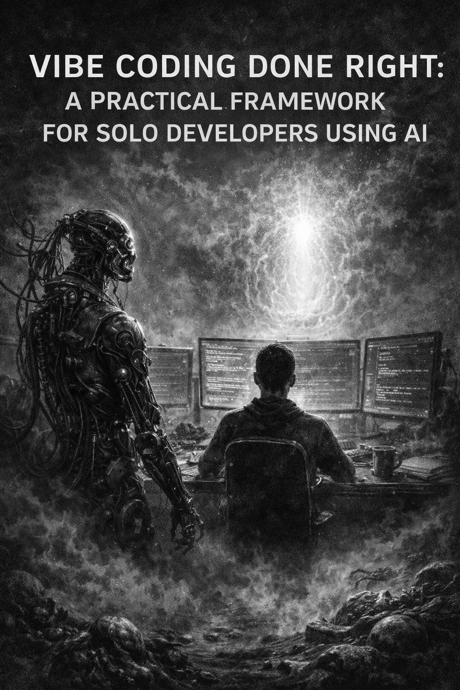

  

# Vibe Coding Done Right: A Practical Framework for Solo Developers Using AI

AI has made solo developers dramatically faster.

It has also made it much easier to create a codebase you can no longer understand two weeks later.

**That is the real problem with vibe coding.**

The issue is not that AI writes bad code by default. The issue is that speed creates entropy. Files appear in the wrong place. Architecture becomes accidental. Decisions go undocumented. The project works today, but becomes harder and harder to resume, debug, and extend over time.

That is the gap this framework is designed to solve.

It came out of a real AI-assisted workflow session and turned into a lightweight system for sustainable solo development: a way to keep the speed of AI without paying for it later in confusion. The result is built around three ideas: **Start Right, Stay Sane, Stay Honest**.

---

## The Problem

Most engineering best-practice docs are written for teams. They assume handoffs, standups, formal reviews, and dedicated process.

That is not how most solo builders using AI actually work.

A solo developer using AI usually has a different failure mode: the code ships fast, the repo gets messy, context disappears, the next work session starts cold, and the project slowly becomes harder to trust.

The real problem is not syntax or logic, but the accumulation of disorder that makes a project feel foreign even to the person who built it.

---

## The Framework

### 1. Start Right

Every project begins with a `PROJECT.md` before real application code is written.

That file includes: what the project is, architecture, key decisions, tech stack, how to run it, env variables, folder structure, current status, known issues, roadmap, and important links.

**Why this matters:** When you come back after a break, you do not want to reverse-engineer your own codebase. You want one source of truth.

A fixed folder structure matters for the same reason. If AI is helping generate code, then every file needs a known home. Otherwise speed turns into structural drift. The rule is simple: **one folder convention, always**.

### 2. Stay Sane

The second layer is a lightweight daily checklist.

**Before coding:** read current project status, define the one thing to finish today, switch to the right branch, restate the problem in plain English.

**While coding:** read all AI-generated code before accepting it, verify file placement, run the app after meaningful changes, break overly long functions down, commit working checkpoints.

**Before stopping:** update current status, review the diff, push to GitHub, log bugs and TODOs.

This is not bureaucracy. It is context preservation.

### 3. Stay Honest

The third layer is the most important: draw a line between what AI can decide and what the developer must decide.

**AI can help with:** scaffolding, CRUD handlers, utilities, styling, tests, and refactoring for readability.

**But the developer must own:** folder and file structure, authentication and security logic, database schema design, error handling strategy, third-party library selection, and environment and config management.

That distinction is what separates useful AI assistance from blind delegation.

The best line in the system is this one:

> **You own everything AI writes.**

That should be the default operating rule for any serious solo developer.

---

## Why This Works

This framework is useful because it adds very little overhead.

It does not ask solo builders to act like a 20-person engineering org. It simply inserts structure at the exact points where entropy usually appears: before work starts, while code is being generated, and before context is lost.

Mature AI-assisted development is not just faster code generation. It is using AI to help create the systems and standards that keep development sustainable over time.

---

## Practical Takeaway

If you are building with AI, do not optimize only for speed.

Optimize for resumption, clarity, consistency, debug-ability, and trust in your own codebase.

That is what makes you faster over a year, not just over a weekend.

---

## Starter Checklist

If you want to adopt this today:

1. Create a `PROJECT.md`
2. Standardize your folder structure
3. Define what AI is allowed to decide
4. Add a before/during/after session checklist
5. Commit small and often
6. Review every AI-generated change before accepting it

**Fast is good. Fast and resumable is better.**

---

## Full Framework

See [`SKILL.md`](./SKILL.md) for the complete, detailed coding standards — including naming conventions, git branch/commit formats, folder structures, AI usage rules, pre-commit checklists, and testing expectations.

---

## License

MIT — use it, fork it, adapt it to your stack.
